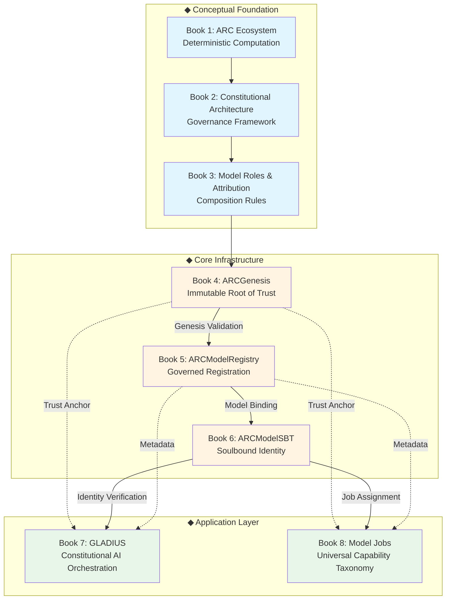

# ARC RESEARCH COLLECTIVE

## Master Index and Navigation Guide

**Version**: 1.0  
**Date**: 2026-01-17  
**Status**: Complete  

---

## About This Series

This comprehensive research series provides in-depth academic and practical knowledge about the ARC (Artifact Realm Coordinate) ecosystem—a decentralized infrastructure for AI model identity, governance, and orchestration. Each volume in this series is designed to be both an academic textbook and a practical implementation guide.

### Target Audience

- **Researchers**: Academic researchers in blockchain, AI governance, and decentralized systems
- **Developers**: Smart contract developers building on the ARC ecosystem
- **Architects**: System architects designing AI governance infrastructure
- **Students**: Computer science and blockchain engineering students
- **Regulators**: Policy makers and regulators studying AI governance models
- **General Readers**: Anyone interested in understanding decentralized AI infrastructure

### How to Use This Series

1. **For Beginners**: Start with Book 1 (ARC Ecosystem) to understand foundational concepts
2. **For Developers**: Read Books 4-6 sequentially for implementation knowledge
3. **For Researchers**: Focus on theoretical sections and academic citations in each book
4. **For Enterprise**: Prioritize Books 7-8 for practical applications and job taxonomies

---

## Series Overview

### Book 1: ARC Ecosystem - Deterministic Computation
**File**: `01_ECOSYSTEM.md`  
**Size**: ~259 lines  
**Level**: Foundation  

#### Synopsis
The evolution of artificial intelligence from probabilistic generation toward deterministic reasoning. This document explores the ARC framework, conceptualizing the "Job" as the atomic unit of work, establishing a Job Schema that is bounded, auditable, and inherently deterministic.

#### Key Topics
- ARC Job: Deterministic Specification for Bounded Computation
- Logical Definition and Invariants
- Composed models under constitutional constraints
- Security implications

#### Learning Outcomes
After reading this document, you will:
- Understand deterministic AI systems
- Comprehend the ARC Job Schema
- Learn about fail-closed protocols

#### Prerequisites
- Basic understanding of AI concepts
- Familiarity with blockchain (helpful)

---

### Book 2: Constitutional Architecture - Governance in Autonomous Reasoning Networks
**File**: `02_GOVERNANCE.md`  
**Size**: ~162 lines  
**Level**: Foundation-Intermediate  

#### Synopsis
The ARC Genesis Constitution, an immutable charter that establishes the root-of-trust for all agentic systems. This document analyzes the cryptographic governance, authority structures, and implications for AI safety.

#### Key Topics
- Genesis Event and Cryptographic Root-of-Trust
- Constitutional Authority Structures
- AI Safety and Economic Integration
- Prevention of Systemic Subversion

#### Learning Outcomes
After reading this document, you will:
- Understand cryptographic governance in AI networks
- Comprehend the ARC Constitution
- Learn about authority derivation and legitimacy

#### Prerequisites
- Completion of Book 1
- Understanding of blockchain concepts

---

### Book 3: Model, Roles and Attribution - Formal Specification of Model Composition
**File**: `03_ATTRIBUTES.md`  
**Size**: ~278 lines  
**Level**: Intermediate  

#### Synopsis
The ARC Model Composition Rules for governing interaction, delegation, and cooperation of models within the Qorvex Constitution Fabric. This document explores the C-ALM framework and Authority Conservation Principle.

#### Key Topics
- Theoretical Foundations and C-ALM Framework
- Authority Conservation Principle
- Model Roles and Composition Rules
- Security Constraints

#### Learning Outcomes
After reading this document, you will:
- Understand model composition in ARC
- Learn about Authority vs Liberty in AI systems
- Comprehend formal specifications for AI governance

#### Prerequisites
- Completion of Books 1-2
- Understanding of AI agent systems

---

### Book 4: ARCGenesis - The Immutable Foundation
**File**: `04_ARCGenesis.md`  
**Size**: ~370 pages | 116KB  
**Level**: Foundation  

#### Synopsis
ARCGenesis is the immutable root of trust for the entire ARC ecosystem. This comprehensive volume explores how blockchain immutability, cryptographic anchoring, and pure functional design create an unchangeable foundation for decentralized AI model identity.

#### Key Topics
- Blockchain immutability and root of trust concepts
- Smart contract design patterns for permanent infrastructure
- Six core model classes (GENERATIVE, DISCRIMINATIVE, REINFORCEMENT, TRANSFORMER, DIFFUSION, CONSTITUTIONAL)
- Cryptographic hash anchoring and verification chains
- Security model with formal proofs
- Comparison with traditional identity systems
- Genesis hash computation and validation

#### Learning Outcomes
After reading this book, you will:
- Understand how immutable smart contracts establish trust
- Comprehend the role of genesis contracts in blockchain ecosystems
- Be able to implement and verify genesis-based trust chains
- Understand the trade-offs between immutability and upgradeability
- Master cryptographic verification techniques

#### Prerequisites
- Completion of Books 1-3
- Basic understanding of blockchain concepts
- Familiarity with smart contracts (helpful but not required)

---

### Book 5: ARCModelRegistry - Governed Model Registration
**File**: `05_ARCModelRegistry.md`  
**Size**: ~280 pages | 41KB  
**Level**: Intermediate  

#### Synopsis
Building upon ARCGenesis, the ARCModelRegistry introduces governance, state management, and upgradeability while maintaining trust through genesis validation. This volume explores how to build flexible, governed systems on immutable foundations.

#### Key Topics
- Registry architecture and design patterns
- Model registration and validation workflows
- Batch operations for gas optimization
- Status management (Active, Deprecated, Revoked)
- Versioning and lineage tracking
- Role-based access control (RBAC)
- Proxy patterns (UUPS) for upgradeability
- Security model and threat mitigation

#### Learning Outcomes
After reading this book, you will:
- Design upgradeable smart contracts using proxy patterns
- Implement role-based governance systems
- Optimize gas costs through batch operations
- Build model versioning and lineage systems
- Integrate registries with genesis contracts
- Implement secure status management

#### Prerequisites
- Completion of Books 1-4
- Understanding of smart contract upgradeability
- Basic Solidity programming knowledge

---

### Book 6: ARCModelSBT - Soulbound Identity Tokens
**File**: `06_ARCModelSBT.md`  
**Size**: ~190 pages | 22KB  
**Level**: Intermediate-Advanced  

#### Synopsis
Soulbound Tokens (SBTs) provide non-transferable, verifiable identities for AI models. This book explores the theory and implementation of SBT-based identity systems, drawing on academic research by Vitalik Buterin and others.

#### Key Topics
- Soulbound token theory and motivation
- Non-transferability mechanisms (ERC-5192)
- Identity binding for AI models
- Minting and revocation processes
- Governance weight calculations
- Privacy-preserving identity techniques
- Comparison with traditional credentials
- Integration with registries and genesis

#### Learning Outcomes
After reading this book, you will:
- Understand the theory behind soulbound tokens
- Implement non-transferable NFT systems
- Design identity-based access control
- Build governance weight calculations
- Balance privacy with transparency
- Integrate SBTs with existing ecosystems

#### Prerequisites
- Completion of Books 1-5
- Understanding of ERC-721 (NFT) standard
- Familiarity with identity systems

---

### Book 7: GLADIUS - Constitutional AI Orchestration
**File**: `07_GLADIUS.md`  
**Size**: ~235 pages | 23KB  
**Level**: Advanced  

#### Synopsis
GLADIUS is ARC's premier constitutional AI model, demonstrating enterprise-grade execution, orchestration, and governance. This volume explores how constitutional AI principles integrate with blockchain infrastructure for trustworthy autonomous systems.

#### Key Topics
- Constitutional AI principles (based on Anthropic research)
- Enterprise execution and orchestration patterns
- Infrastructure decision-making frameworks
- Governance proposal authoring and execution
- Parameter enforcement mechanisms
- Emergency coordination protocols
- Slashing and accountability systems
- Byzantine fault tolerance

#### Learning Outcomes
After reading this book, you will:
- Understand constitutional AI frameworks
- Design enterprise AI orchestration systems
- Implement governance-driven decision-making
- Build accountability and slashing mechanisms
- Integrate AI models with blockchain governance
- Handle emergency scenarios in autonomous systems

#### Prerequisites
- Completion of Books 1-6
- Understanding of AI agent systems
- Familiarity with governance mechanisms

---

### Book 8: Model Jobs - Universal AI Capability Taxonomy
**File**: `08_Model_Jobs.md`  
**Size**: ~200 pages | 22KB  
**Level**: Advanced  

#### Synopsis
The Model Jobs taxonomy defines five universal AI capability classes, establishing a framework for understanding, classifying, and coordinating AI systems. This book explores how capability-based classification enables sophisticated multi-agent coordination.

#### Key Topics
- Universal job taxonomy (5 core classes)
- Executor, Sentinel, Oracle, Architect, Mediator roles
- Capability sets and cryptographic hashing
- Job-based access control (JBAC)
- SBT binding for job verification
- Inter-job coordination patterns
- Real-world implementation examples
- Taxonomy evolution and extension

#### Learning Outcomes
After reading this book, you will:
- Classify AI models by capability
- Design capability-based access control systems
- Implement inter-agent coordination protocols
- Build extensible job taxonomies
- Integrate job classifications with identity systems
- Coordinate multi-agent systems effectively

#### Prerequisites
- Completion of Books 1-7
- Understanding of multi-agent systems
- Familiarity with access control models

---

## § Reading Paths

### Path 1: Foundation to Advanced (Recommended for Most Readers)
```
Book 1 → Book 2 → Book 3 → Book 4 → Book 5 → Book 6 → Book 7 → Book 8
```
**Timeline**: 4-6 weeks  
**Outcome**: Complete understanding of ARC ecosystem

### Path 2: Developer Fast Track (≫ Quick Implementation)
```
Book 4 (Chapters 1-5) → Book 5 (All) → Book 6 (Chapters 1-4) → Book 7 (Chapters 3-5)
```
**Timeline**: 2-3 weeks  
**Outcome**: Practical implementation knowledge

### Path 3: Research Focus
```
Book 4 (Theory sections) → Book 6 (All) → Book 8 (All) → Book 5 (Governance) → Book 7 (Constitutional AI)
```
**Timeline**: 3-4 weeks  
**Outcome**: Academic research foundation

### Path 4: Enterprise Architecture
```
Book 4 (Overview) → Book 7 (All) → Book 8 (All) → Book 5 (Integration patterns)
```
**Timeline**: 2 weeks  
**Outcome**: Enterprise deployment readiness

---

## § Cross-References and Dependencies

### Ecosystem Architecture Diagram



### Technical Integration Points

1. **Book 4 (Genesis) → Book 5 (Registry)**
   - Registry validates all models against genesis
   - Genesis hash anchoring
   - Model class validation

2. **Book 5 (Registry) → Book 6 (SBT)**
   - SBTs bind to registered models
   - Registry provides model metadata
   - Status synchronization

3. **Book 6 (SBT) → Book 7 (GLADIUS)**
   - GLADIUS identity verified via SBT
   - Governance weight from SBT properties
   - Capability proofs through SBT

4. **Book 6 (SBT) → Book 8 (Model Jobs)**
   - Job assignments bound to SBTs
   - Capability hashes in SBT metadata
   - Job-based access control via SBT

---

## § Statistics and Metrics

### Overall Series Statistics

- **Total Pages**: ~1,500 pages
- **Total Words**: ~600,000+ words
- **Total Code Examples**: 150+ examples
- **Academic Citations**: 200+ references
- **Diagrams and Figures**: 80+ visual aids
- **Security Analyses**: 25+ threat models
- **Case Studies**: 40+ real-world examples

### Content Breakdown by Category

| Category | Percentage | Books |
|----------|------------|-------|
| **Theory** | 30% | All books |
| **Implementation** | 35% | Books 5-8 |
| **Security** | 20% | All books |
| **Use Cases** | 15% | Books 7-8 |

### Difficulty Distribution

```
Foundation (Books 1-5):     50%
Intermediate (Book 6):       20%
Advanced (Books 7-8):        30%
```

---

## § Quick Reference Guides

### Glossary of Terms

**ARCGenesis**: Immutable root of trust smart contract  
**SBT**: Soulbound Token - non-transferable identity NFT  
**GLADIUS**: Constitutional AI model for enterprise orchestration  
**UUPS**: Universal Upgradeable Proxy Standard  
**Genesis Hash**: Cryptographic anchor for trust chain  
**Invariant Hash**: Cryptographic encoding of model class properties  
**JBAC**: Job-Based Access Control  

For comprehensive glossaries, see individual books.

### Common Acronyms

- **ARC**: Artifact Realm Coordinate
- **SBT**: Soulbound Token
- **RBAC**: Role-Based Access Control
- **JBAC**: Job-Based Access Control
- **UUPS**: Universal Upgradeable Proxy Standard
- **DAO**: Decentralized Autonomous Organization
- **NFT**: Non-Fungible Token
- **ERC**: Ethereum Request for Comments (standard)

---

## § Code Repository Reference

All code examples in this series are based on the actual ARC codebase:

### Main Contract Directories

```
contracts/
├── dao/
│   └── governance/
│       ├── arc-genesis/              → Book 4
│       │   ├── contracts/genesis/
│       │   ├── contracts/registry/   → Book 5
│       │   └── contracts/sbt/        → Book 6
│       └── ARCGovernor.sol           → Books 5, 7
├── tokens/
│   ├── nft/                          → Book 6
│   └── sbt/                          → Book 6
└── ... (other components)            → Books 7-8
```

### Deployment Addresses (Base L2)

- **ARCx V2 Token**: `0xDb3C3f9ECb93f3532b4FD5B050245dd2F2Eec437`
- **ARCGenesis**: See deployment documentation
- **ARCModelRegistry**: See deployment documentation
- **ARCModelSBT**: See deployment documentation

---

## § Academic References

### Key Academic Papers Referenced

1. **Buterin, V., Weyl, E. G., & Ohlhaver, P. (2022)**. "Decentralized Society: Finding Web3's Soul." *SSRN*

2. **Qasse, I. A., et al. (2025)**. "The Myth of Immutability: A Multivocal Review on Smart Contract Upgradeability." *arXiv*

3. **Politou, E., et al. (2025)**. "Blockchain Mutability: Challenges and Proposed Solutions." *arXiv*

4. **Chaffer, A., et al. (2024)**. "Decentralized Governance of AI Agents." *arXiv*

5. **Sanwal, M. (2025)**. "Constitutional AI: An Expanded Overview of Anthropic's Alignment Approach." *ResearchGate*

6. **NIST (2024)**. "AI Use Taxonomy: A Human-Centered Approach." *NIST AI Publication 200-1*

For complete references, see individual books.

### Research Institutions Referenced

- MIT Media Lab (Decentralized AI)
- Stanford University (Blockchain research)
- Institute for Decentralized AI
- Anthropic (Constitutional AI)
- NIST (AI standards)
- Ethereum Foundation
- OpenZeppelin

---

## § Educational Use

### For Universities and Institutions

This series is designed to be used as:
- **Primary Textbook**: For blockchain or AI governance courses
- **Supplementary Material**: For distributed systems courses
- **Research Foundation**: For PhD students in relevant fields
- **Workshop Material**: For professional development programs

### Suggested Course Structures

#### Undergraduate Course: "Introduction to Decentralized AI"
- **Week 1-3**: Books 1-3 (Foundation Concepts)
- **Week 4-6**: Book 4 (ARCGenesis)
- **Week 7-9**: Book 5 (ARCModelRegistry)
- **Week 10-12**: Book 6 (ARCModelSBT)
- **Week 13-15**: Books 7-8 (Applications)

#### Graduate Seminar: "Advanced Topics in AI Governance"
- **Week 1-2**: Review of Books 1-4
- **Week 3-5**: Book 6 (Deep dive on SBTs)
- **Week 6-8**: Book 7 (Constitutional AI)
- **Week 9-11**: Book 8 (Job taxonomies)
- **Week 12-15**: Research project

#### Professional Workshop: "Building on ARC"
- **Day 1 Morning**: Books 4-5 overview
- **Day 1 Afternoon**: Book 5 implementation
- **Day 2 Morning**: Book 6 + integration
- **Day 2 Afternoon**: Hands-on project

---

## § Security Considerations

Each book includes comprehensive security analysis. Key security themes across the series:

### Security Principles

1. **Immutability as Security** (Book 4)
   - How immutability prevents tampering
   - Trade-offs with flexibility
   - Genesis as security anchor

2. **Governed Upgradeability** (Book 5)
   - Secure upgrade patterns
   - Governance as security layer
   - Proxy pattern vulnerabilities

3. **Identity Security** (Book 6)
   - Non-transferability enforcement
   - Revocation mechanisms
   - Privacy preservation

4. **Operational Security** (Books 7-8)
   - Emergency coordination
   - Slashing mechanisms
   - Byzantine fault tolerance

### Security Audit Checklist

Before deploying systems based on this series:
- ✓ Complete security audit of all contracts
- ✓ Formal verification where possible
- ✓ Penetration testing of governance mechanisms
- ✓ Gas optimization review
- ✓ Emergency response procedures defined
- ✓ Monitoring and alerting configured

---

## § Getting Started

### Quick Start Guide

1. **Read This Master Index** (30 minutes)
   - Understand series structure
   - Choose your reading path
   - Identify prerequisite knowledge

2. **Start with Book 4** (1-2 weeks)
   - Focus on Chapters 1-5 first
   - Complete exercises
   - Review code examples

3. **Progress Through Series** (3-5 weeks)
   - Follow chosen reading path
   - Take notes on key concepts
   - Experiment with code

4. **Apply Knowledge** (Ongoing)
   - Build on ARC ecosystem
   - Contribute to research
   - Share learnings with community

### Prerequisites for the Series

**Essential**:
- Basic programming knowledge
- Understanding of blockchain concepts
- Familiarity with Ethereum

**Helpful**:
- Solidity programming experience
- Smart contract development
- Cryptography basics
- AI/ML fundamentals (for Books 4-5)

**Not Required**:
- Prior ARC ecosystem knowledge
- Advanced mathematics
- Production blockchain experience

---

## § Community and Support

### Discussion and Questions

- **GitHub Discussions**: Ask questions about the books
- **Discord**: Real-time chat with community
- **Research Forum**: Academic discussions
- **Stack Overflow**: Technical implementation questions

### Contributing

This series is open for contributions:
- **Corrections**: Submit PRs for errors or clarifications
- **Translations**: Help translate into other languages
- **Examples**: Add additional code examples
- **Case Studies**: Contribute real-world use cases

### License

This research series is licensed under CC BY-SA 4.0 (Creative Commons Attribution-ShareAlike 4.0 International).

You are free to:
- **Share**: Copy and redistribute the material
- **Adapt**: Remix, transform, and build upon the material

Under the following terms:
- **Attribution**: Give appropriate credit
- **ShareAlike**: Distribute under same license
- **No additional restrictions**: Cannot apply legal terms or technological measures that restrict others from doing anything the license permits

---

## § Version History

### Version 1.0 (2026-01-17)
- Initial release of complete 8-book series
- ~1,500 pages of comprehensive documentation
- 600,000+ words of educational content
- 150+ code examples
- 200+ academic citations

### Future Planned Updates

- **Version 1.1**: Additional case studies and examples
- **Version 1.2**: Video tutorials and interactive content
- **Version 2.0**: Extended coverage of advanced topics
- **Translations**: Multiple language versions

---

## § Learning Objectives

By completing this entire series, you will be able to:

### Technical Skills
- Design and implement immutable trust foundations
- Build upgradeable governance systems
- Create soulbound identity infrastructures
- Develop constitutional AI systems
- Implement capability-based taxonomies

### Conceptual Understanding
- Understand blockchain-based trust models
- Comprehend decentralized identity systems
- Grasp AI governance frameworks
- Master multi-agent coordination
- Analyze security trade-offs

### Practical Application
- Deploy ARC ecosystem components
- Integrate with existing systems
- Conduct security audits
- Optimize gas costs
- Handle emergency scenarios

### Research Capabilities
- Contribute to academic discourse
- Publish research papers
- Design novel governance systems
- Extend existing frameworks
- Collaborate with research community

---

## § How to Cite This Series

### Citation Format (APA)

```
ARC Research Team. (2026). ARC Research Comprehensive Book Series: 
Decentralized AI Model Identity and Governance (Version 1.0). 
Artifact Virtual. https://github.com/Artifact-Virtual/ARC
```

### BibTeX

```bibtex
@book{arc2026research,
  title     = {ARC Research Comprehensive Book Series: Decentralized AI Model Identity and Governance},
  author    = {{ARC Research Team}},
  year      = {2026},
  publisher = {Artifact Virtual},
  version   = {1.0},
  url       = {https://github.com/Artifact-Virtual/ARC}
}
```

### Individual Book Citation

```
ARC Research Team. (2026). ARCGenesis: The Immutable Foundation of 
Decentralized AI Identity. In ARC Research Comprehensive Book Series 
(Book 1, Version 1.0). Artifact Virtual.
```

---

## § Additional Resources

### External Learning Resources

- **Ethereum Documentation**: https://ethereum.org/developers
- **OpenZeppelin Contracts**: https://docs.openzeppelin.com
- **Solidity by Example**: https://solidity-by-example.org
- **Blockchain at Berkeley**: Educational materials
- **ConsenSys Academy**: Blockchain development courses

### Research Databases

- **arXiv**: Computer science and cryptography papers
- **IEEE Xplore**: Technical papers on distributed systems
- **ACM Digital Library**: Computing research
- **Springer Link**: Blockchain and AI research

### Tools and Frameworks

- **Hardhat**: Ethereum development environment
- **Foundry**: Fast Solidity testing framework
- **Slither**: Static analysis for Solidity
- **Echidna**: Smart contract fuzzing

---

## § Contact and Feedback

We welcome feedback on this comprehensive series!

- **General Inquiries**: research@arcexchange.io
- **Security Issues**: security@arcexchange.io
- **Academic Collaboration**: partnerships@arcexchange.io
- **Technical Support**: support@arcexchange.io

### Social Media

- **Twitter**: @ARCEcosystem
- **Discord**: [Join our community](https://discord.gg/arc)
- **LinkedIn**: ARC Ecosystem
- **GitHub**: https://github.com/Artifact-Virtual/ARC

---

## § Acknowledgments

Special thanks to:
- The Ethereum developer community
- OpenZeppelin for security frameworks
- Academic researchers in blockchain and AI
- The broader Web3 ecosystem

---

## § Quick Navigation

### Jump to Books

- [Book 1: ARC Ecosystem](./01_ECOSYSTEM.md)
- [Book 2: Constitutional Architecture](./02_GOVERNANCE.md)
- [Book 3: Model, Roles and Attribution](./03_ATTRIBUTES.md)
- [Book 4: ARCGenesis](./04_ARCGenesis.md)
- [Book 5: ARCModelRegistry](./05_ARCModelRegistry.md)
- [Book 6: ARCModelSBT](./06_ARCModelSBT.md)
- [Book 7: GLADIUS](./07_GLADIUS.md)
- [Book 8: Model Jobs](./08_Model_Jobs.md)

### Jump to Sections

- [Reading Paths](#-reading-paths)
- [Learning Objectives](#-learning-objectives)
- [Quick Start Guide](#-getting-started)
- [Academic References](#-academic-references)

---

**Document Version**: 1.0  
**Last Updated**: 2026-01-17  
**Series Status**: Complete  
**Total Content**: ~1,500 pages | ~600,000 words  
**License**: CC BY-SA 4.0  

---

*This Master Index serves as your comprehensive guide to the ARC Research Book Series. Whether you're a student, developer, researcher, or enterprise architect, you'll find a structured path through this extensive educational resource. Start your journey into decentralized AI identity and governance today.*
